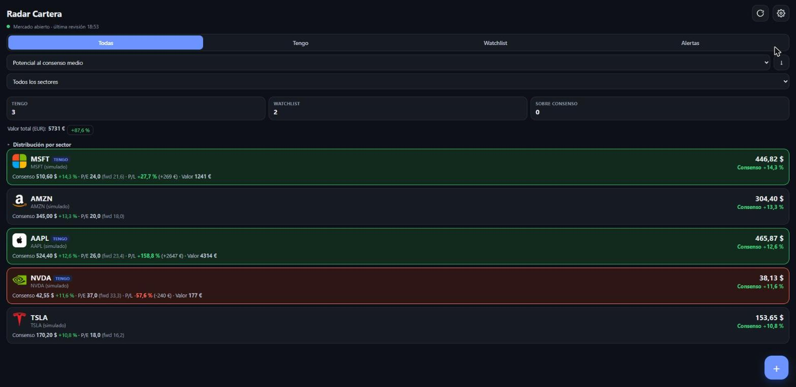
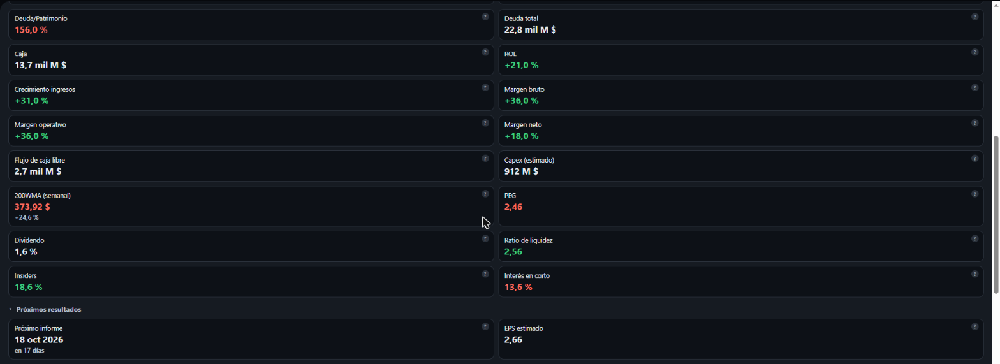

# Radar Cartera

App personal (un solo usuario) para seguir una cartera y watchlist de acciones: precio
casi en tiempo real (incl. pre-market/after-hours), consenso de analistas, tus propios
objetivos y notificaciones push. Ver `radar-cartera-spec.md` para la especificación
completa. PWA sin frameworks + Cloudflare Worker (gratis) + KV + cron cada 5 min.

> Capturas con datos simulados (`MOCK=1`), no mi cartera real.

<p>
  
  
</p>

## Qué hace

- Precio casi en tiempo real (pre-market/after-hours incluidos), consenso de analistas,
  P/E, decenas de fundamentales (deuda, márgenes, ROE, PEG, insiders, interés en corto...)
  y **fecha de los próximos resultados** — todo gratis, sin claves de pago obligatorias.
- Alertas push (ntfy) cuando el precio se acerca o supera el consenso, tu objetivo de
  venta/compra, o se aleja mucho de lo que opinan los analistas — con histéresis para no
  machacar con el mismo aviso.
- Posiciones (P/L, valor) convertidas también a EUR para quien invierte en USD pero
  piensa en euros. Si indicas cuánto gastaste realmente en euros al comprar (dato de tu
  bróker), la ganancia en EUR se calcula exacta en vez de aproximarla con la tasa de
  cambio de hoy.
- Distribución de la cartera por sector/industria, filtro y orden por cualquier métrica.
- Simulador de estrategia "vender X% arriba, recomprar Y% abajo" sobre el histórico real.
- Instalable como PWA en el móvil (Android/iOS), con notificaciones nativas vía ntfy.

## Probar en local (sin desplegar)

```
npm install
npm test          # tests con node:test
npm run dev       # wrangler dev, http://127.0.0.1:8787
```

`.dev.vars` (no se sube al repo) ya trae `APP_TOKEN=dev-token` y `MOCK=1` para poder
probar sin claves reales ni gastar peticiones — precios y consensos son simulados pero
deterministas. Prueba rápida:

```
curl -H "Authorization: Bearer dev-token" http://127.0.0.1:8787/api/diag?symbol=AAPL
```

Para probar contra las fuentes reales, quita o pon a `0` `MOCK` en `.dev.vars`.

## Desplegar de verdad (para usarla desde el móvil)

1. Instalar **Node.js LTS** desde nodejs.org (ya lo tienes si has llegado hasta aquí).
2. Crear una cuenta gratuita en **Cloudflare** (dash.cloudflare.com).
3. Iniciar sesión de Wrangler con tu cuenta (abre el navegador):
   ```
   npx wrangler login
   ```
4. Crear el namespace de KV donde vivirá todo el estado:
   ```
   npx wrangler kv namespace create KV
   ```
   Copia el `id` que devuelve en `wrangler.toml`, sustituyendo `PEGAR_AQUI_EL_ID`.
5. Conseguir las claves gratuitas:
   - **financialmodelingprep.com** → `FMP_KEY` (consenso de analistas).
   - **finnhub.io** (opcional) → `FINNHUB_KEY` (respaldo de precio y nº de analistas).
6. Elegir una contraseña larga para la app (`APP_TOKEN`) y un nombre de topic de ntfy
   largo y aleatorio (`NTFY_TOPIC`, ej. `radar-` + 24 caracteres al azar — funciona como
   contraseña, que no lo adivine nadie). Guardarlos como secretos de Wrangler:
   ```
   npx wrangler secret put APP_TOKEN
   npx wrangler secret put NTFY_TOPIC
   npx wrangler secret put FMP_KEY
   npx wrangler secret put FINNHUB_KEY
   ```
7. Desplegar:
   ```
   npm run deploy
   ```
   Devuelve una URL `https://radar-cartera.<tu-cuenta>.workers.dev`.
8. Verificar que las fuentes de datos funcionan de verdad:
   ```
   curl -H "Authorization: Bearer <tu APP_TOKEN>" "https://radar-cartera.<tu-cuenta>.workers.dev/api/diag?symbol=AAPL"
   ```
9. En el Android:
   - Abrir esa URL en **Chrome** → menú ⋮ → **Añadir a pantalla de inicio**.
   - Abrir la app → Ajustes → pegar tu `APP_TOKEN`.
   - Instalar **ntfy** (Google Play o F-Droid) → **Suscribirse a tema** → pegar el mismo
     nombre que pusiste en `NTFY_TOPIC`.
   - Ajustes de la app → **Enviar notificación de prueba** → debe llegar a ntfy.
10. Opcional: añadir la variable `APP_URL` en `wrangler.toml` (o `wrangler secret put APP_URL`)
    para que al tocar la notificación se abra la app.

## Cron y coste

El Worker corre un ciclo cada 5 minutos (`*/5 * * * *`) que actualiza precios (si algún
mercado puede estar abierto), refresca hasta 4 consensos de analistas caducados y manda
avisos. Todo dentro del plan gratuito de Cloudflare (KV + 100k peticiones/día del Worker);
ver spec §4.4 para el presupuesto de peticiones.

## Estructura

```
src/
  worker.js   entrada: fetch() + scheduled()
  api.js      rutas /api/* y el ciclo del cron
  sources.js  Yahoo / FMP / Finnhub (+ modo MOCK)
  state.js    KV, forma de los items, importación
  alerts.js   motor de reglas con histéresis
  notify.js   ntfy + silencio nocturno
  time.js     horarios de mercado (NY / Madrid)
public/       PWA (HTML + CSS + JS vanilla, sin build)
test/         tests con node:test
```
